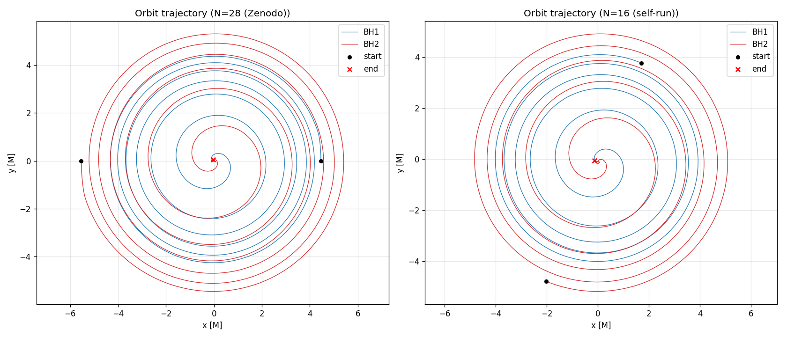
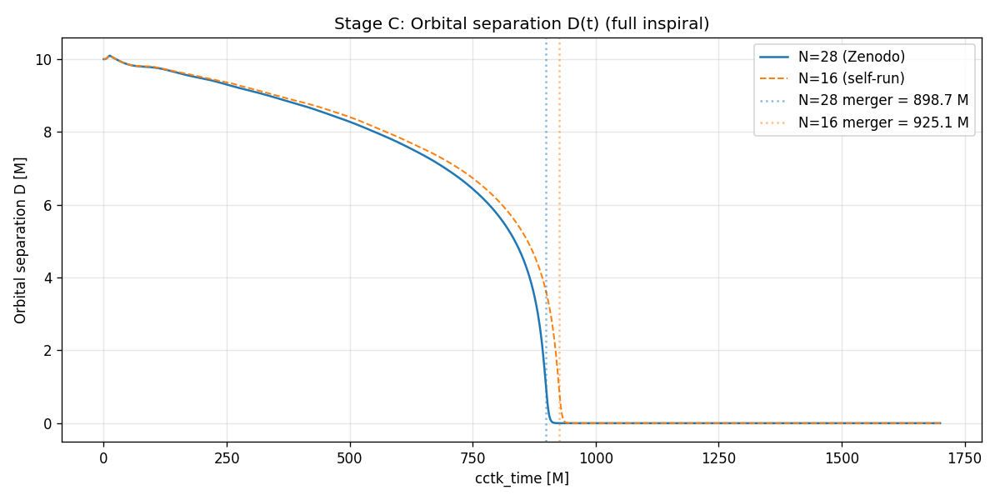
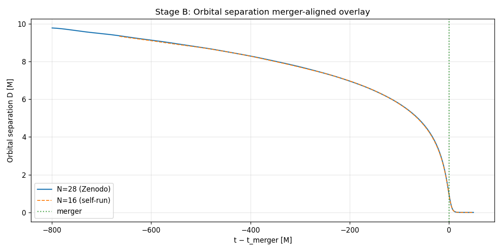
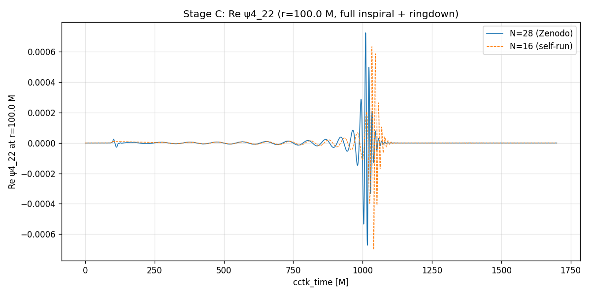
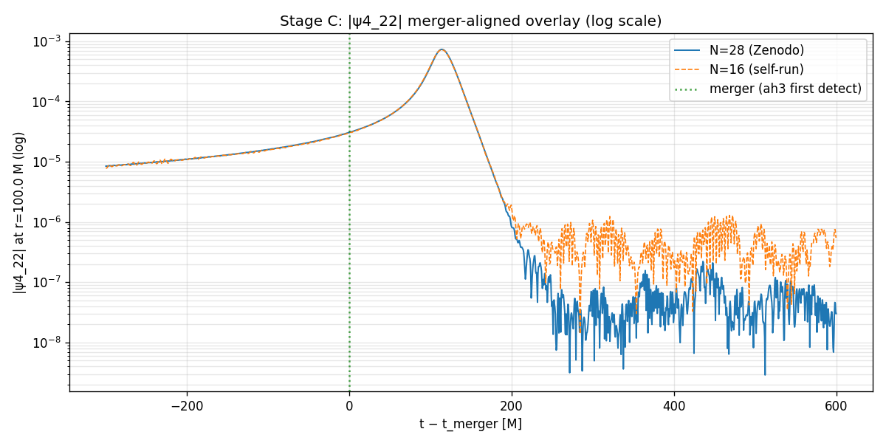
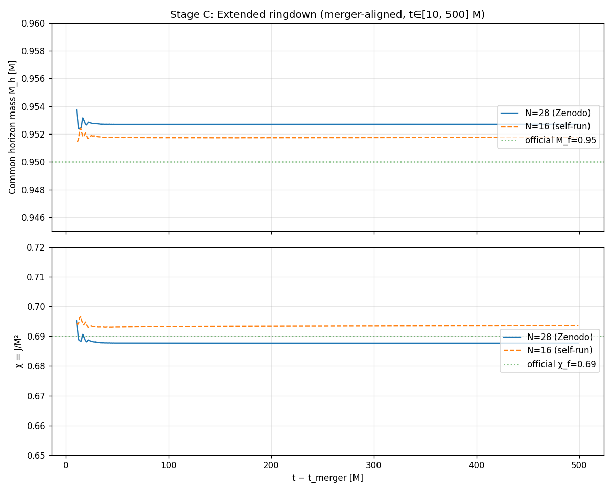

- GitHub repository: [s-sasaki-earthsea-wizard/gw150914-einstein-toolkit](https://github.com/s-sasaki-earthsea-wizard/gw150914-einstein-toolkit)
  - The development environment is established with Docker, so you can reproduce the environment easily. Einstein Toolkit is notoriously known for difficult builds and dependencies.

In September 2015, LIGO directly detected gravitational waves for the first time in human history. The event, **GW150914**, came from the merger of two stellar-mass black holes more than a billion light-years away. To extract that signal from instrument noise — and to confirm what produced it — researchers compared the observed waveform against numerical relativity simulations that solve Einstein's field equations on supercomputers.

Over a long holiday from April end to May beginning (in Japan, so called Golden Week), I tried to run one of those simulations on my home PC.

This post is a writeup of that project: why I attempted it, what broke, the compromises I had to make to fit a multi-day binary-black-hole simulation into a 16-core, 93 GiB workstation, and how the results compared with the official Zenodo reference data.

A disclaimer up front: **this is not novel research**. The Einstein Toolkit gallery already publishes the parameters and outputs for this exact configuration. LIGO papers and follow-up numerical relativity work have done all of this — at higher resolution, more rigorously, years ago. What I did was reproduce a published computation at a coarser grid spacing on consumer hardware. The interesting parts are not the physics but the experience: what it actually takes for an amateur to run this end-to-end, and what shows up when you put your own data next to the canonical reference.

## Why bother

I had a long holiday coming up. I was going to be away from home, my workstation would otherwise be idle, and I wanted to throw a long-running computation at it. The constraint was simple: it had to finish before I returned, and I wanted it to be something I would actually care about looking at afterward.

GW150914 is the obvious answer. It is the most famous numerical relativity result of the last decade, the parameter file is fully public via the [Einstein Toolkit gallery](https://einsteintoolkit.org/gallery/bbh/index.html), and there is reference output on Zenodo (DOI: [10.5281/zenodo.155394](https://doi.org/10.5281/zenodo.155394)) to compare against. The whole exercise reduces to: run a published parameter file, plot the outputs, see how close I got.

That turned out to be a slightly complex challenge.
I now realize how superficial my first thought was.

## A flash physics primer of Binary Black Hole Merger

Skip this section if you already know what gravitational waves are.

Gravitational waves are ripples in spacetime emitted by accelerating masses. If you put a finger on water surface and vibrate it, you can see the water surface wave. Simply taking, both are similar phenomena.
Einstein predicted them in 1916; LIGO confirmed them a century later.

GW150914 was produced by a **binary black hole (BBH) merger**: two black holes of $\approx 36\,M_\odot$ and $\approx 29\,M_\odot$ spiraling together to form a single $\approx 62\,M_\odot$ remnant. The "missing" $\approx 3\,M_\odot$ was radiated away as gravitational waves — an enormous amount of energy released over a fraction of a second.

A BBH coalescence has three phases:

| Phase | What happens |
| --- | --- |
| **Inspiral** | The two black holes orbit each other, spiraling inward as they radiate energy. |
| **Merger** | The horizons fuse into a single common horizon and the wave amplitude peaks. |
| **Ringdown** | The newly formed Kerr black hole oscillates at a characteristic frequency and damps. |

My goal was to reproduce all three phases qualitatively and check the quantitative numbers (merger time, peak amplitude, final-BH mass and spin) against the reference run.

## Why this is a hard computation

The thing being solved is the **Einstein field equations**: ten coupled, nonlinear partial differential equations for the spacetime metric. Two specific properties make BBH simulations considerably difficult:

1. **Singularities.** Each black hole contains a curvature singularity that the numerical scheme has to avoid without crashing.
2. **Numerical stability.** The naive form of the equations is ill-posed for time evolution; you need a carefully reformulated system (cf: BSSN formalism) to get stable evolutions over many orbital timescales.

The first end-to-end BBH merger simulation only succeeded in 2005. Before that, "inspiral all the way through merger to ringdown" was effectively unreachable.

## Hardware reality check

Here is what the official gallery setup expects, vs. what I have:

| | Official gallery | This project | Ratio |
| --- | --- | --- | --- |
| Grid spacing $h_0$ | 1.224 M (fine) | 2.143 M | 1.75× coarser |
| Parallelism | 128 MPI processes | 1 MPI × OMP=16 (16 cores) | ~1/8 |
| Memory | 98 GB | 28.76 GiB peak | ~1/3 |

(The internal resolution parameter is `N=28` for the gallery and `N=16` for this run — it sets the number of grid points around each black hole.)

At the official `N=28`, the memory was technically within reach on my 93 GiB box, but extrapolating wall-clock time pointed to **16+ days** to reach ringdown. That violated the only hard constraint I had — finish over the long weekend — so I dropped to `N=16`, accepting a 1.75× coarser grid. Validation would happen by comparing against Zenodo's `N=28` output rather than against LIGO observations directly, since the resolution gap rules out a meaningful direct-to-observation comparison.

## Crash on startup

Running the official parameter file with `N=16` aborted almost immediately:

```text
ABORT: Interpolate2/test.cc:77
  refinement level > 0 grid contains
  inter-patch boundary points
```

The cause turns out to be a fairly subtle interaction between two things this kind of simulation needs:

- **A hybrid coordinate system** — a fine "inner" patch around each BH that handles the strong-field region, and an "outer" patch that propagates the waves out to the extraction radius.
- **Adaptive mesh refinement (AMR)** — finer grids near the black holes, coarser grids further out, with a buffer zone between refinement levels to interpolate cleanly across the boundary.

The AMR buffer is measured in **grid cells**, but its physical thickness scales with the grid spacing. So when you increase the grid spacing, the buffer grows in physical units:

| | $h_0$ | Buffer thickness | Result |
| --- | --- | --- | --- |
| `N=28` (official) | 1.224 M | ~6 M | OK |
| `N=16` (this run) | 2.143 M | ~10.7 M (1.75×) | crash |

At the coarser resolution, the buffer pokes into the inner-patch / outer-patch seam, and the inter-patch boundary interpolation breaks. The fix is to **physically enlarge the inner patch** so the buffer never reaches the seam: I expanded the inner patch radius from 51.40 M to 77.10 M (~1.5×). With that one change, the simulation ran stably at `N=16` with the AMR hierarchy intact.

The lesson is one that the official gallery actually warns about, but you only really internalize it once a parameter file blows up in your face: **simulation parameters are tuned for a specific resolution**. Changing the grid spacing is not free; it propagates into every length-scale-dependent setting downstream.

## Don't run 1700 M in one shot

The full physical-time evolution from initial data through ringdown is ~1700 M (geometric units, so M is the total ADM mass. In general relativity, both time and length are denoted by mass M via the gravitational constant and speed of light as: $G = c = 1$). On my hardware that translates to **~80+ wall-clock hours**. Running it as a single job was a bad idea: if anything went wrong at hour 60, I would have wasted three days of compute and would have a hard time isolating where it broke.

I split the run into three checkpoints:

| Stage | Physical time | What it validates |
| --- | --- | --- |
| A | 0 → 100 M | Initial data, early inspiral |
| B | 100 → 1000 M | Full inspiral, reaches merger |
| C | 1000 → 1700 M | Completes ringdown |

After each stage I compared trajectories and waveforms against the Zenodo reference before launching the next.

## How close did `N=16` get?

The headline result: **closer than I expected**.

### Orbits

The xy-plane trajectories of the two black holes overlap almost perfectly with the `N=28` reference — the same number of orbits, the same inspiral shape, the same final plunge.



The orbital separation $D(t)$ tells the same story, with one quantitative difference: at `N=16` the merger happens **~26 M later** than the reference (925.1 M vs 898.7 M, +2.94%). This is exactly the kind of small phase drift you expect from a coarser grid — the inspiral is slightly under-dissipative, so the binary takes a bit longer to plunge.



If you align the two runs at the merger time instead of the simulation start, the curves lie on top of each other:



### Waveform

The real part of the $\psi_4$ extraction at $r = 100\,M$ shows the same envelope and the same merger spike — just shifted in phase by the same ~26 M as the orbit.

While the waveform differs from the reference for quantitative evaluation, we can grasp it qualitatively.



Aligning by merger time and plotting the amplitude on a log scale, the inspiral and merger peak match almost exactly. The peak amplitude differs by only **−1.79%** (7.21e-4 vs 7.34e-4). The post-merger ringdown noise floor is visibly higher in my run above $10^{-6}$ — which is the kind of thing you would expect coarser refinement to do.



### Final black hole

Tracking the mass and the spin of the final state black hole:



| Quantity | `N=16` | `N=28` (Zenodo) | Difference |
| --- | --- | --- | --- |
| Merger time | 925.1 M | 898.7 M | +2.94% |
| Final BH mass $M_f$ | 0.9518 | 0.9527 | −0.10% |
| Final BH spin $\chi_f$ | 0.6930 | 0.6877 | +0.0054 (abs) |
| Number of orbits | 5.08 | 4.92 | +0.15 |
| $\psi_4$ peak amplitude | 7.21e-4 | 7.34e-4 | −1.79% |
| $\psi_4$ peak time | 113.7 M | 114.0 M | −0.28 M |

All within the loose tolerances I set for a coarse-grid run, and well within the official LIGO uncertainty for the published BBH parameters.

### Mass loss

The most viscerally satisfying number for me was the mass radiated as gravitational waves. With $M$ the total initial mass:

$$
\Delta M \;=\; M - 0.9518\,M \;=\; 0.0482\,M \;\simeq\; 3.13\,M_\odot
$$

The Zenodo reference gives $\approx 3.07\,M_\odot$, and LIGO's published value is $3.0 \pm 0.5\,M_\odot$. The famous "three solar masses of energy released as gravitational waves in a fraction of a second" — I had it sitting in an HDF5 file on my own disk.

## What I actually learned

Running numerical simulations certainly required overcoming several difficulties and was quite challenging, but it is not a fundamentally scientific struggle.
The harder part is staying honest about what they mean.

I didn't write the Einstein Toolkit. 
I didn't derive BSSN or any of the formulations that make these evolutions stable. 
I built a development environment for Einstein Toolkit, edited a parameter file, fixed one resolution-induced crash, ran a published configuration on coarser grids, and made some matplotlib plots. The reason this worked at all is that an enormous amount of expertise from the numerical relativity community is embedded in the code I downloaded.

It is also worth saying: an LLM helped a lot. Most of the grunt work — debugging the inter-patch crash, slicing HDF5 outputs, building comparison plots, automating the three-stage checkpointing — happened with Claude Opus 4.7 in the loop. Without that I doubt I could have completed this over a weekend. (I have a separate talk planned about the pros and cons of doing science-flavored work this way; I will write that one up as its own post.)

There is a quote from [Professor Dr. Masaru Shibata's 2010 review on the state of numerical relativity in Japan](https://www2.yukawa.kyoto-u.ac.jp/ws/2010/tap2010/pdf/22_10_shibata.pdf) that I keep coming back to. Roughly translated:

> "We are entering an era when anyone can do numerical relativity. People will be able to write code without knowing relativity. Code will be shared and easily picked up. — But: trivial and dubious work will also appear. People who confidently publish wrong results will multiply."
>
> "The important work is what you do **after** the simulation: extracting the physics. A result you cannot explain in three lines should not be trusted. When you get a result, think hard until you can explain it in three lines, add the physical interpretation, then publish."

In 2010 he was looking at the proliferation of public numerical-relativity codes. In 2026, with LLMs in the loop, the gap between "I can run this" and "I can correctly interpret this" is wider than ever. I can produce plots that look right. I cannot, on my own, defend them rigorously. The two have to be kept separate.

I just ran the simulation on my home computer, and it works based on the professional researcher's work. 
It doesn't mean I can understand numerical relativity.

At the same time, it brings me happy that even laypeople can recreate historically important physical phenomena on my own PCs by leveraging results shared by the research community.

I thank from the bottom of my heart the open attitude of professional researchers, which indeed contributes to the development of science, technology, and engineering.

## Summary

- Running the official parameters as-is at `N=16` crashes at startup; expanding the inner coordinate patch from 51.40 M to 77.10 M fixes it.
- The full 1700 M evolution (inspiral → merger → ringdown) finished in ~3.5 wall-clock days when split into three checkpointed stages.
- At `N=16` versus the `N=28` Zenodo reference, the orbits overlap, the merger time drifts by +2.94%, the peak waveform amplitude differs by −1.79%, and the final BH mass and spin agree to <0.1% and 0.005 respectively.
- Total mass radiated as gravitational waves: $\approx 3.13\,M_\odot$ — within LIGO's published $3.0 \pm 0.5\,M_\odot$.

You can absolutely do this on a workstation. You should also be honest about what doing it actually means.

## Appendix: compute resources

| Stage | Wall time | Peak memory |
| --- | --- | --- |
| Stage A (0 → 100 M) | 6h 51m | 26.91 GiB |
| Stage B (100 → 1000 M) | 49h 39m | 28.76 GiB |
| Stage C (1000 → 1700 M) | 27h 54m | 22.79 GiB |
| **Total** | **84h 24m (~3.5 days)** | — |
